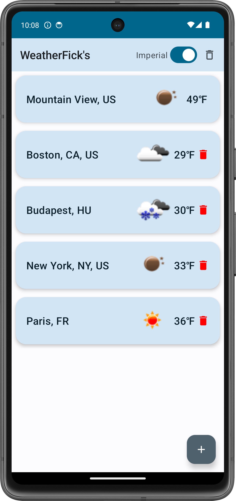
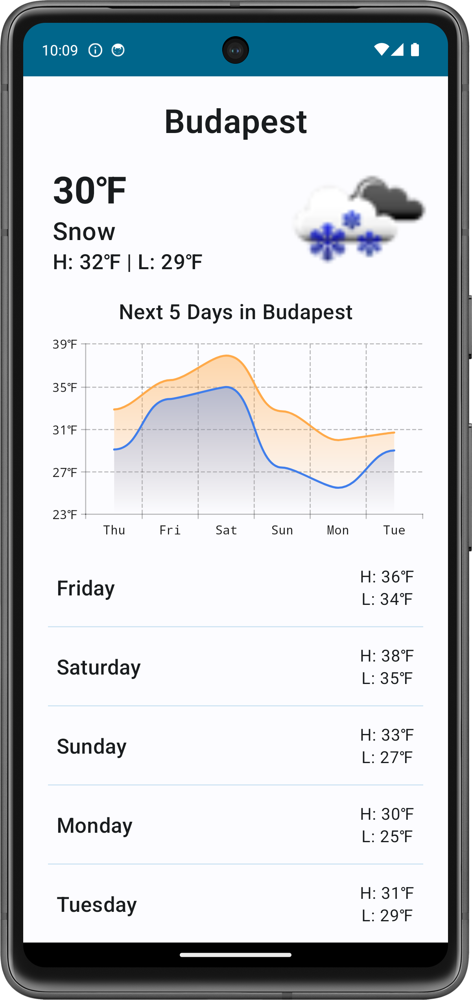

# WeatherFick's

## Description
This is an app designed for letting users keep track of the weather in the cities they are interested it. The app will automatically show the weather of the current location of the user, and will also allow the user to add cities to their list of cities to keep track of. The app will also allow the user to remove cities from their list.

## Implementation
The app implements a SQLite database framework for local storage of the cities, ROOM object relation mapping, as well as dependency injection with HILT. The app also uses Retrofit for networking, and works with the Android Location permission framework to get the current location of the user. 

## Usage
To run, simply press play on the emulator in Android Studio, and have fun!

## Example Screens

  

   

